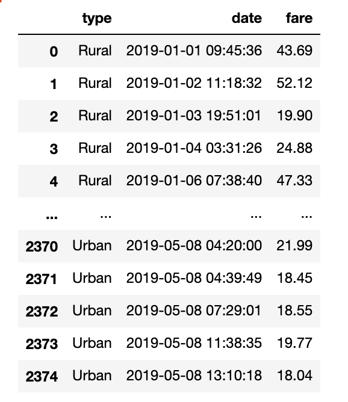
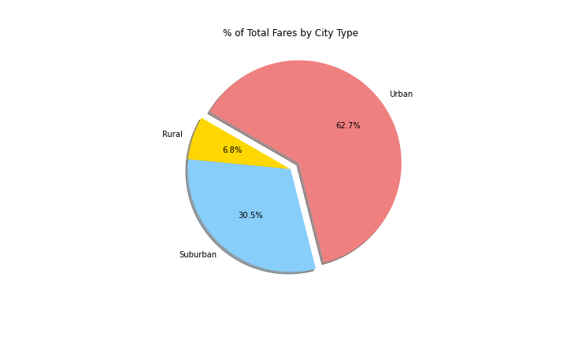

# PyBer_Analysis
# Overview of Analysis
The purpose of this analysis is to reveal data patterns in Urban, Suburban, and Rural Rides; Fares; and Driver Types
We are displaying the results of this to show how over time these trends behaved between the different variable types (Urban, Suburban, and Rural Rides; Fares; and Driver Types

# Results

As we can see from the results, Urban had the most amount of Rides given, and the Fares had variancees from below $8 to above $43
Rural rides were the least profitable while Urban rides were the most

# Recommendations
While using dataframes is great, it is not the easiest on the eye for people to view
With Rural rides being the least common, we may want to consider cancelling those as a service as they are not even 10% of our profit, metrics, drivers, etc
We should try to find a way to expand our reach in Suburban rides
